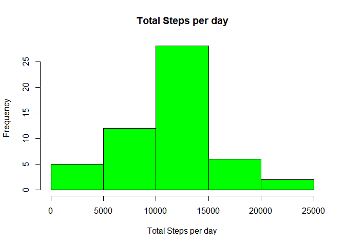
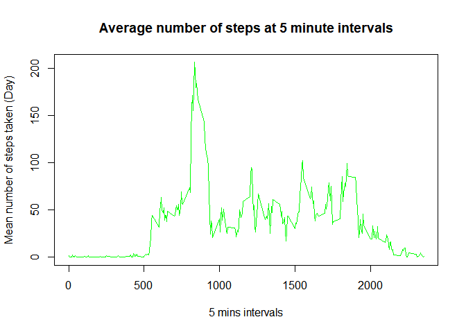
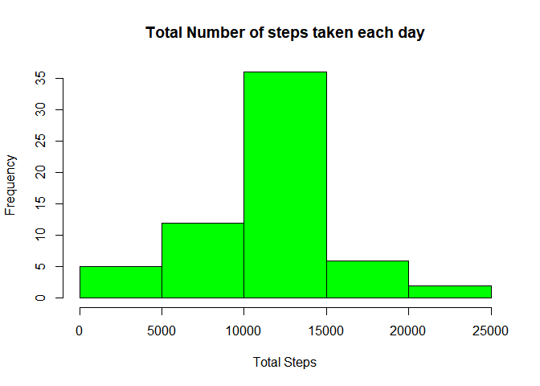
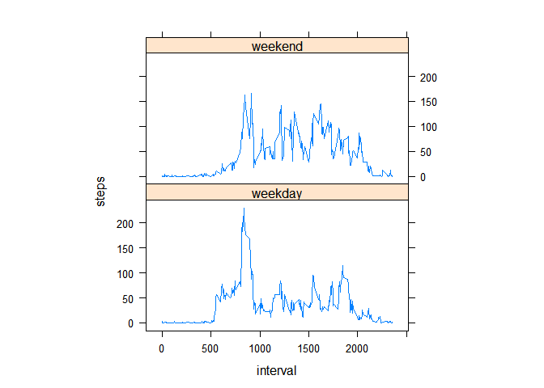

# Reproducible Research: Peer Assessment 1

## Introduction

It is now possible to collect a large amount of data about personal
movement using activity monitoring devices such as a
[Fitbit](http://www.fitbit.com), [Nike
Fuelband](http://www.nike.com/us/en_us/c/nikeplus-fuelband), or
[Jawbone Up](https://jawbone.com/up). These type of devices are part of
the "quantified self" movement -- a group of enthusiasts who take
measurements about themselves regularly to improve their health, to
find patterns in their behavior, or because they are tech geeks. But
these data remain under-utilized both because the raw data are hard to
obtain and there is a lack of statistical methods and software for
processing and interpreting the data.

This assignment makes use of data from a personal activity monitoring
device. This device collects data at 5 minute intervals through out the
day. The data consists of two months of data from an anonymous
individual collected during the months of October and November, 2012
and include the number of steps taken in 5 minute intervals each day.


## Loading and preprocessing the data

### Download and unzip, load the data to activity.

```r
tmp <- tempfile()
download.file("https://d396qusza40orc.cloudfront.net/repdata%2Fdata%2Factivity.zip", tmp, mode="wb", method="curl")
unzip(tmp, "activity.csv")
activity <- read.table("activity.csv", sep=",", header=T)
```

## What is mean total number of steps taken per day?

** Use aggregate funciton to get the total steps **

```r
summary(activity)
```

```
##      steps                date          interval     
##  Min.   :  0.00   2012-10-01:  288   Min.   :   0.0  
##  1st Qu.:  0.00   2012-10-02:  288   1st Qu.: 588.8  
##  Median :  0.00   2012-10-03:  288   Median :1177.5  
##  Mean   : 37.38   2012-10-04:  288   Mean   :1177.5  
##  3rd Qu.: 12.00   2012-10-05:  288   3rd Qu.:1766.2  
##  Max.   :806.00   2012-10-06:  288   Max.   :2355.0  
##  NA's   :2304     (Other)   :15840
```

```r
tolSteps <- aggregate(steps ~ date, data = activity, sum, na.rm = TRUE)
mean_steps <- mean(tolSteps$steps)
median_steps <- median(tolSteps$steps)

cat ("Mean Step = ", mean_steps)
```

```
## Mean Step =  10766.19
```

```r
cat ("Median Step = ", median_steps)
```

```
## Median Step =  10765
```

```r
hist(tolSteps$steps,col="green",main="Total Steps per day",xlab="Total Steps per day",cex.axis=1,cex.lab = 1)
```

<!-- -->

## What is the average daily activity pattern?

** Use 5 minutes interval to analysis the data

```r
steps_5m <- aggregate(steps ~ interval, data = activity, mean, na.rm = TRUE)

plot(steps ~ interval, data = steps_5m, type = "l", xlab = "5 mins intervals", ylab = "Mean number of steps taken (Day)", main = "Average number of steps at 5 minute intervals",  col = "green")
```

<!-- -->

** Which 5-minute interval, on average across all the days in the dataset, contains the maximum number of steps?


```r
maxSteps <- steps_5m [which.max(steps_5m$steps),"interval"]
maxSteps
```

```
## [1] 835
```

## Imputing missing values

** Calculate and report the total number of missing values in the dataset

```r
missing_val <- sum(!complete.cases(activity))
missing_val
```

```
## [1] 2304
```

```r
## Function returns the mean steps for a given interval
getMeanStepsPerInterval <- function(interval){
    steps_5m[steps_5m$interval==interval,"steps"]
}

## create a new dataset that filled in with missing value
new_activity <- activity

## Filling the missing values with the mean for that 5-minute interval
count = 0  ## missing value
for (i in 1:nrow(new_activity)) {
    if (is.na(new_activity[i,"steps"])) {
        new_activity[i,"steps"] <- getMeanStepsPerInterval(new_activity[i,"interval"])
        count = count + 1  
        }
}

cat ("Fill in missing row = ", count)
```

```
## Fill in missing row =  2304
```

```r
## Draw the histogram

steps_perdays <- aggregate(steps ~ date, data = new_activity, sum)
hist(steps_perdays$steps, col = "green", xlab = "Total Steps", 
     ylab = "Frequency", main = "Total Number of steps taken each day")
```

<!-- -->

## Are there differences in activity patterns between weekdays and weekends?


```r
# Now split up the data so that it's sorted by weekday or weekend
# Use POSIXlt class so wday is part of this class wday is an integer ranging from 0 to 6 
# that represents the day of the week 0 is for Sunday, 1 is for Monday, going up to 6 for Saturday
# Sunday (0) %% 6 = 0, Sat (6) %% 6 = 0

new_activity$day <- ifelse(as.POSIXlt(as.Date(new_activity$date))$wday%%6 == 0, "weekend", "weekday")
new_activity$day <- factor(new_activity$day, levels = c("weekday", "weekend"))

# now new_activity has the new column 'day', which its value is either 'weekday' or 'weekend'

# Make a panel plot containing a time series plot of 5-minute interval (x) and the average number of steps
# taken, averaged across all weekday or weekend days (y).

library(lattice)

new_steps= aggregate(steps ~ interval + day, new_activity, mean)
xyplot(steps ~ interval | factor(day), data = new_steps, aspect = 1/2, type = "l")
```

<!-- -->
